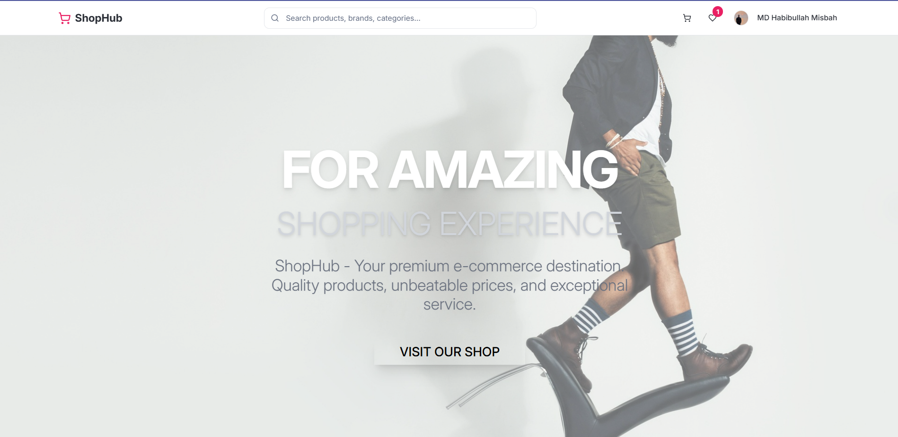
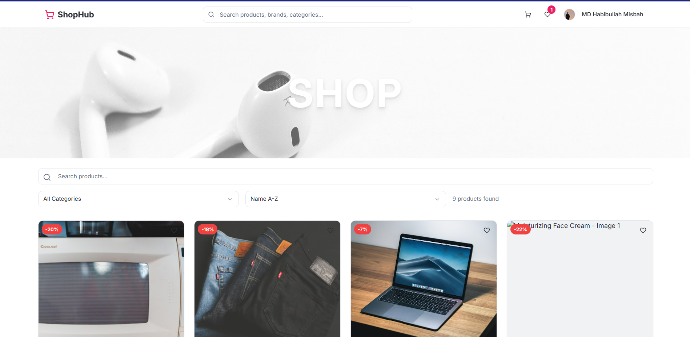
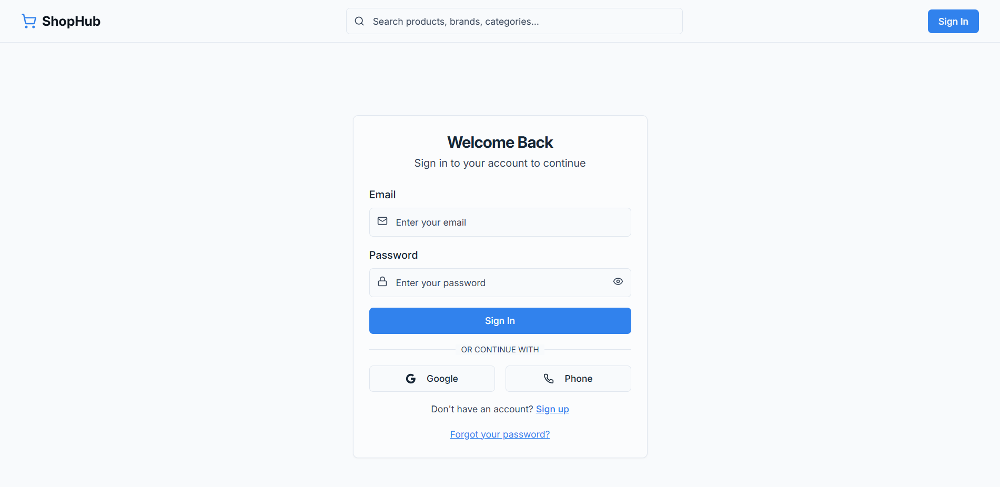
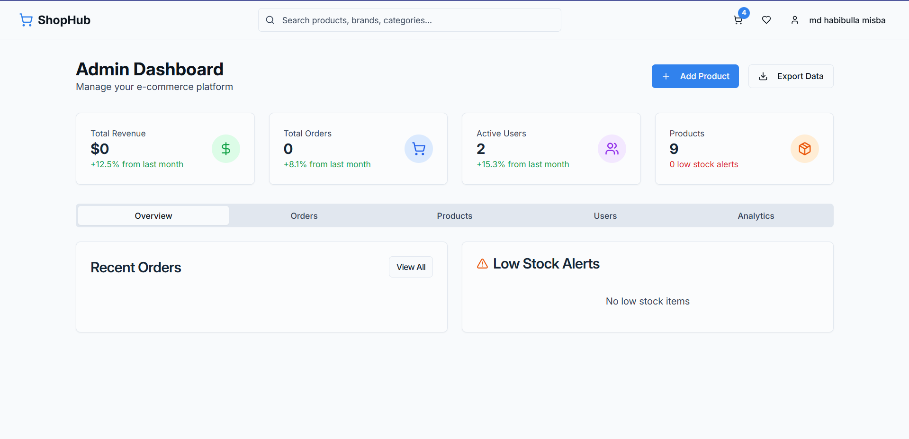
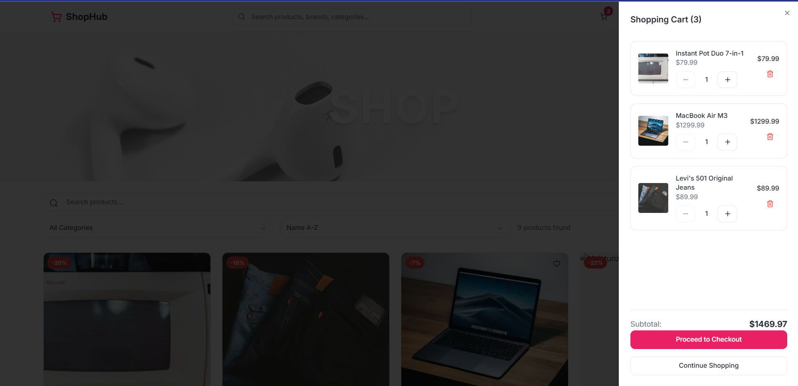
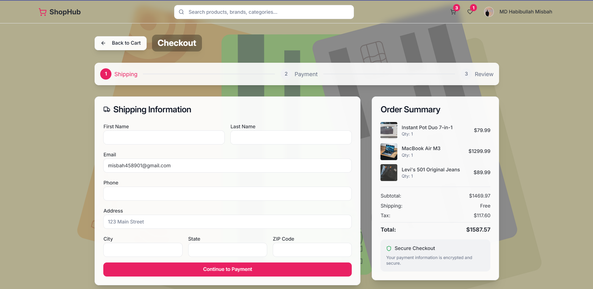
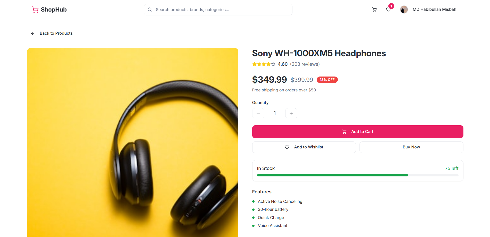
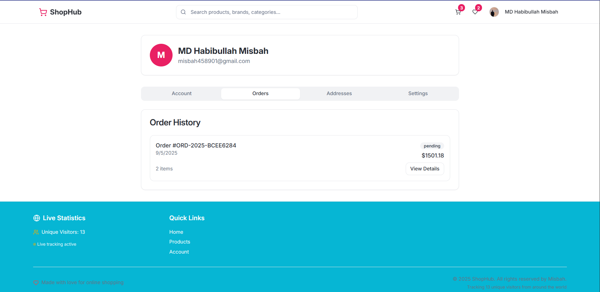
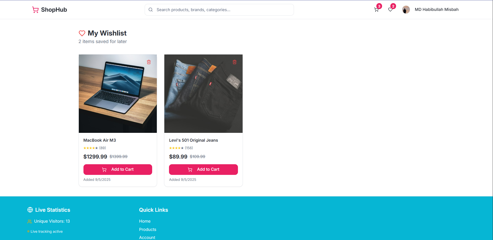

# ShopHub - E-commerce Platform

A modern, full-stack e-commerce platform built with React, TypeScript, Node.js, and PostgreSQL.

##  Features

- **Modern UI**: Built with React 18, TypeScript, and Tailwind CSS
- **Authentication**: Firebase Auth with email/password and Google sign-in
- **Product Management**: Full CRUD operations for products and categories
- **Shopping Cart**: Persistent cart with real-time updates
- **Payment Processing**: Stripe and PayPal integration
- **Order Management**: Complete order lifecycle tracking
- **Responsive Design**: Mobile-first design with responsive layouts
- **Admin Dashboard**: Product and order management interface
- **Search & Filtering**: Advanced product search and category filtering

## Screenshots

Get a visual overview of the ShopHub e-commerce platform:

###  Homepage
*Modern, responsive design with featured products and categories*


###  Products Page
*Advanced filtering, search, and grid/list view options*


###  Authentication
*Clean, user-friendly login and registration interface*


###  Admin Dashboard
*Comprehensive admin panel for product and order management*


### Cart Page
*Cart*


### Checkout
*Checkout*


### Details
*Product Details*


### Order
*Order List*


### Wishlist
*Saved Wishlist*


###  Key Visual Features
- **Responsive Design**: Seamless experience across mobile, tablet, and desktop
- **Modern UI**: Clean, professional interface with intuitive navigation
- **Interactive Elements**: Hover effects, smooth animations, and touch-friendly controls
- **Accessibility**: WCAG compliant design with proper contrast and navigation
- **Performance**: Optimized loading and smooth user interactions

###  Design Highlights
- **Mobile-First**: Optimized for all screen sizes with breakpoint-specific layouts
- **Dark/Light Mode**: Adaptive theming for user preference
- **Component Library**: Built with Radix UI for accessibility and consistency
- **Animations**: Smooth transitions and micro-interactions using Framer Motion
- **Typography**: Carefully chosen font hierarchy and spacing

> **Note**: All screenshots show the fully responsive design working across different device sizes. The platform automatically adapts to provide the best user experience on any screen.

##  Tech Stack

### Frontend
- **React 18** with TypeScript
- **Tailwind CSS** for styling
- **Radix UI** for accessible components
- **React Query** for data fetching
- **Wouter** for routing
- **React Hook Form** for form handling

### Backend
- **Node.js** with Express
- **TypeScript** for type safety
- **Drizzle ORM** for database operations
- **PostgreSQL** database
- **Firebase Auth** for authentication

### Payment & Services
- **Stripe** for credit card payments
- **PayPal** for PayPal payments
- **Firebase** for authentication
- **Neon** for PostgreSQL hosting

##  Prerequisites

- Node.js 18+ 
- npm or yarn
- PostgreSQL database (recommended: [Neon](https://neon.tech/))
- Firebase project
- Stripe account
- PayPal developer account

##  Quick Start

1. **Clone the repository**
   ```bash
   git clone <your-repo-url>
   cd EcomStorefront
   ```

2. **Install dependencies**
   ```bash
   npm install
   ```

3. **Set up environment variables**
   ```bash
   cp .env.example .env
   ```
   
    **Important**: See [ENVIRONMENT_SETUP.md](./ENVIRONMENT_SETUP.md) for detailed setup instructions
   
    **Security**: Read [SECURITY.md](./SECURITY.md) before pushing to GitHub

4. **Set up the database**
   ```bash
   npm run db:push
   ```

5. **Seed the database** (optional)
   ```bash
   npx tsx server/seed.ts
   ```

6. **Start the development server**
   ```bash
   npm run dev
   ```

7. **Open your browser**
   ```
   http://localhost:3000
   ```

##  Project Structure

```
EcomStorefront/
├── client/                 # React frontend
│   ├── src/
│   │   ├── components/     # Reusable UI components
│   │   ├── pages/          # Page components
│   │   ├── lib/            # Utilities and configurations
│   │   └── hooks/          # Custom React hooks
├── server/                 # Node.js backend
│   ├── routes.ts           # API routes
│   ├── db.ts              # Database connection
│   ├── storage.ts         # Database operations
│   └── index.ts           # Server entry point
├── shared/                 # Shared types and schemas
│   └── schema.ts          # Database schema and types
├── .env                   # Environment variables
├── .env.example          # Environment variables template
└── ENVIRONMENT_SETUP.md  # Detailed setup guide
```

##  Available Scripts

- `npm run dev` - Start development server
- `npm run build` - Build for production
- `npm run start` - Start production server
- `npm run check` - Type checking
- `npm run db:push` - Push database schema

##  Core Features

### Authentication
- Email/password registration and login
- Google Sign-in integration
- Protected routes and user sessions
- User profile management

### Product Management
- Product catalog with categories
- Product search and filtering
- Product details with images and specifications
- Admin product management

### Shopping Experience
- Add to cart functionality
- Wishlist management
- Checkout process
- Order history

### Payment Processing
- Stripe credit card payments
- PayPal payments
- Order confirmation and tracking
- Payment status management

##  Deployment

### Environment Setup
1. Copy `.env.example` to `.env`
2. Fill in all required environment variables:

**Database:**
```bash
DATABASE_URL=your_postgresql_connection_string
```

**Firebase Authentication:**
```bash
VITE_FIREBASE_API_KEY=your_firebase_api_key_here
VITE_FIREBASE_AUTH_DOMAIN=your-project-id.firebaseapp.com
VITE_FIREBASE_PROJECT_ID=your-project-id
VITE_FIREBASE_STORAGE_BUCKET=your-project-id.firebasestorage.app
VITE_FIREBASE_MESSAGING_SENDER_ID=your_messaging_sender_id
VITE_FIREBASE_APP_ID=your_app_id
```

**Payment Providers:**
```bash
STRIPE_SECRET_KEY=sk_test_your_stripe_secret_key
STRIPE_PUBLISHABLE_KEY=pk_test_your_stripe_publishable_key
PAYPAL_CLIENT_ID=your_paypal_client_id
PAYPAL_CLIENT_SECRET=your_paypal_client_secret
```

### Database Setup
1. Create a PostgreSQL database (recommended: [Neon](https://neon.tech/))
2. Set the `DATABASE_URL` in your `.env` file
3. Run `npm run db:push` to create tables

### Firebase Setup
1. Create a Firebase project at [Firebase Console](https://console.firebase.google.com/)
2. Enable Authentication with Email/Password and Google
3. Get your configuration from Project Settings > General > Your apps
4. Add the values to your `.env` file

### Payment Setup
1. **Stripe**: Get API keys from [Stripe Dashboard](https://dashboard.stripe.com/)
2. **PayPal**: Get credentials from [PayPal Developer](https://developer.paypal.com/)
3. Add the keys to your `.env` file

### Production Deployment
1. Set `NODE_ENV=production`
2. Use production API keys
3. Enable analytics and monitoring
4. Set up domain and SSL

##  API Documentation

The backend provides REST API endpoints for:

- `/api/auth/*` - Authentication endpoints
- `/api/products/*` - Product management
- `/api/categories/*` - Category management
- `/api/cart/*` - Shopping cart operations
- `/api/orders/*` - Order management
- `/api/payments/*` - Payment processing

##  Contributing

1. Fork the repository
2. Create a feature branch
3. Make your changes
4. Test thoroughly
5. Submit a pull request

##  License

This project is licensed under the MIT License.

##  Support

- Check [ENVIRONMENT_SETUP.md](./ENVIRONMENT_SETUP.md) for setup issues
- Review the troubleshooting section for common problems
- Open an issue for bugs or feature requests
